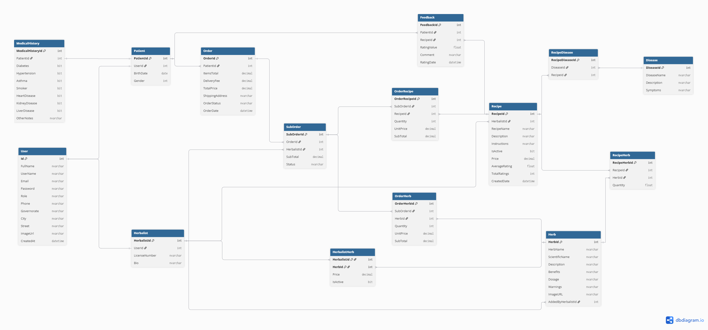
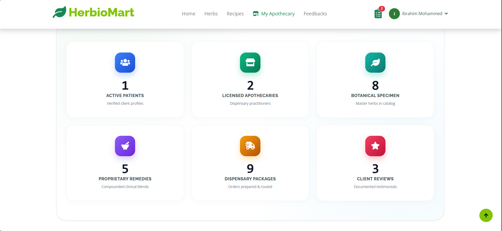
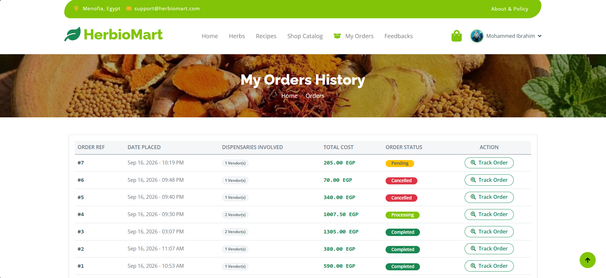
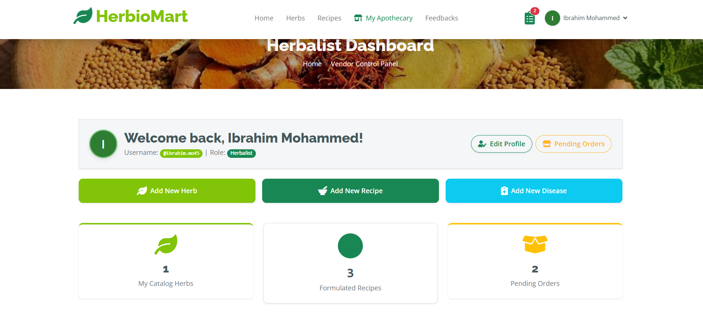
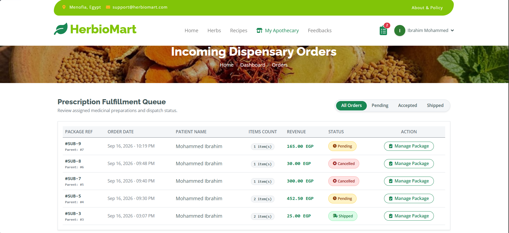

# HerbioMart 🌿
> **Enterprise Herbal E-Commerce & Botanical Compounding Platform**  
> A specialized healthcare web ecosystem connecting certified apothecaries (herbalists) with patients seeking validated medicinal formulations and raw botanical specimens.

---

## 📌 Project Overview & Purpose

**HerbioMart** is an e-commerce and health-management platform developed with **ASP.NET Core MVC** and **Entity Framework Core**. The system bridges the gap between traditional herbal medicine and modern digital commerce through strict verification standards, multi-dispensary logistics, and intellectual property protection for master formulations.

### Key Objectives:
* **Standardized Botanical Catalog:** Classifying herbs by common name, Latin botanical taxonomy, active chemical compounds, recommended daily dosages, and contraindications.
* **Proprietary Compounding Protection:** Protecting herbalist compounding recipes (proportions and preparation steps) from unauthorized access, unlocking details only for patients who have purchased the formulation.
* **Multi-Dispensary Order Routing:** Splitting a unified checkout cart into independent dispensary sub-orders (`SubOrders`) per vendor, each managed and fulfilled individually.
* **Clinical Feedback Mechanism:** Enabling patients to evaluate remedies via fractional-rating inputs (e.g., 4.3 / 5.0) paired with observations to establish evidence-based reviews.

---

## 🗄️ Database Architecture & Relational Workflows

The platform relies on a relational architecture structured around multi-tenant dispensary routing and role-separated user data:

  

* **Users & Roles:** Identity mapping separating `Patients` and `Herbalists` linked to a base `User` entity.
* **Orders & Sub-Orders:** A master `Order` encapsulates one or more `SubOrders` grouped by vendor dispensary (`HerbalistId`), with cascade-safe item tracking (`OrderHerbs` and `OrderRecipes`).
* **Formulation Mapping:** `Recipes` aggregate multiple `RecipeHerbs` (quantities in grams) and target multiple `RecipeDiseases` (`Diseases`).
* **Testimonials:** Verified `Feedback` records linked directly to `RecipeId` and `PatientId`.

---

## 🚀 Key Architectural Features

### 1. Multi-Vendor Sub-Order Routing & State Sync
* Single checkout splits line items into independent vendor sub-orders.
* Automated parent order status synchronization:
  * If **all** sub-orders are cancelled $\rightarrow$ Parent order flips to `Cancelled`.
  * If **all** active sub-orders are shipped $\rightarrow$ Parent order flips to `Completed`.
  * If **any** sub-order is accepted/shipped $\rightarrow$ Parent order transitions to `Processing`.
* Address sanitization pipeline strips concatenated checkout tokens to provide clean shipping details to dispensary fulfillment staff.

### 2. Proprietary Formulation Monograph Protection
* Intellectual property security via authorization policy in `RecipeService`:
  * **Herbalists:** Can inspect public recipes and manage their own formulations.
  * **Patients:** Can view basic recipe cards and pricing, but full preparation instructions and botanical proportions remain restricted until an order is placed and confirmed.

### 3. Fractional Clinical Review Engine
* Dual-input rating module supporting 0.1 step precision (1.0 to 5.0) via an interactive range slider and synchronized dropdown controls.
* Live client-side star renderer visualizing full, half, and empty FontAwesome stars dynamically.

### 4. Real-time Dashboard Scaffolding (`ViewComponents`)
* `SiteStatsViewComponent`: Renders real-time platform statistics (Patients, Herbalists, Catalog Herbs, Compounded Blends, Orders, and Testimonials).
* Smooth counter-up animation powered by modern JavaScript `IntersectionObserver`.
* Responsive horizontal slider with Next/Previous touch/click navigation for featured remedies.

---

## 🛠️ Technology Stack

| Layer | Technologies |
| :--- | :--- |
| **Backend Framework** | C# 14 / .NET 10 (ASP.NET Core MVC) |
| **Data Access & ORM** | Entity Framework Core (Code-First / Fluent API) |
| **Database Engine** | Microsoft SQL Server |
| **Frontend Framework** | Bootstrap + Custom CSS Modules (Glassmorphism, CSS Grid) |
| **Client Scripting** | Vanilla JavaScript (ES6+), jQuery, Owl Carousel |
| **Icons & Typography** | FontAwesome 6 (Free Solid / Regular) |
| **Authentication** | Cookie-Based Authentication with Claims & Role-Based Access Control |

---

## 👥 Role-Based Access Control (RBAC)

| System Privilege | Guest / Visitor | Verified Patient | Licensed Herbalist |
| :--- | :---: | :---: | :---: |
| Browse Public Herb & Recipe Catalog | ✅ | ✅ | ✅ |
| Purchase Herbs & Formulations | ❌ | ✅ | ❌ |
| Create & Manage Formulations | ❌ | ❌ | ✅ (Own Formulas) |
| Manage Dispensary Sub-Orders | ❌ | ❌ | ✅ (Assigned Orders) |
| Access Full Recipe Monograph Details | ❌ | 🔒 Purchased Only | ✅ |
| Submit & Edit Clinical Reviews | ❌ | ✅ | ❌ |

---

## 📸 Platform Showcase & Screenshots

### 1. Storefront & Patient Ecosystem
| Platform Landing & Ecosystem Statistics | Verified Patient Community Reviews |
| :---: | :---: |
|  |  |

| Smooth-Scroll Featured Remedies |
| :---: |
|  |

### 2. Dispensary Operations & Compounding
| Licensed Herbalist Dashboard | Dispensary Package Fulfillment Queue |
| :---: | :---: |
|  |  |

---

## 👥 Development Team

* **Team Lead:** Youssef Dabash
* **Team Members:**
  * [Mohammed Aref]
  * [Rawda Islam]
  * [Sarah Mohamed]